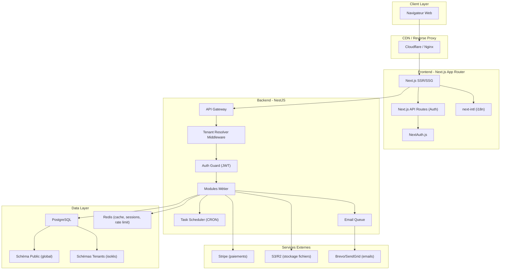
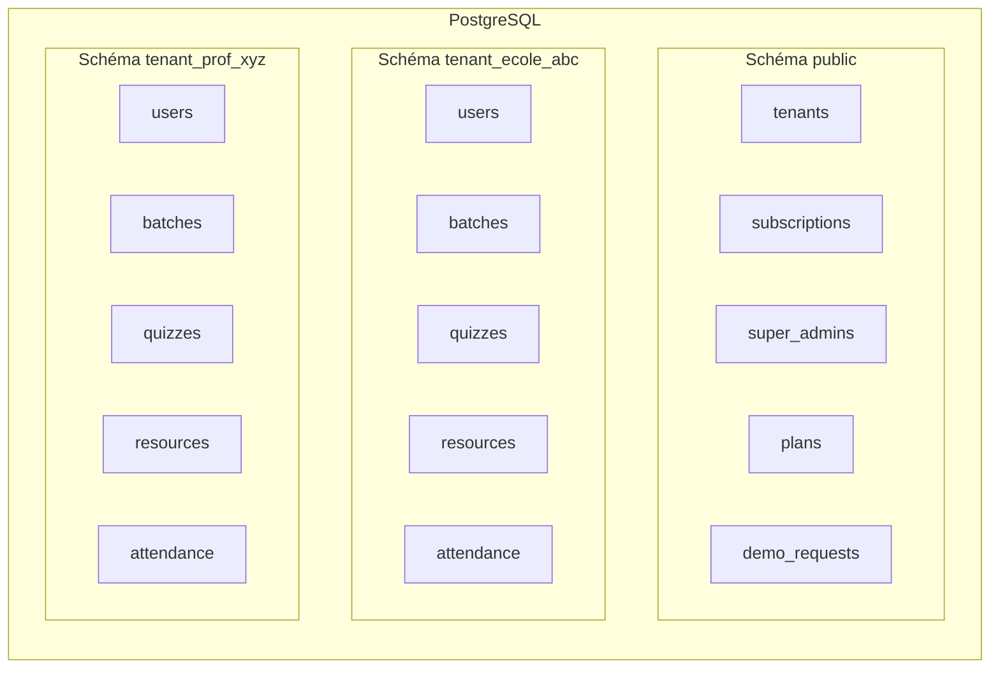
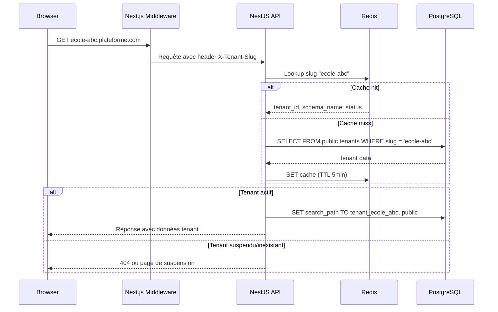
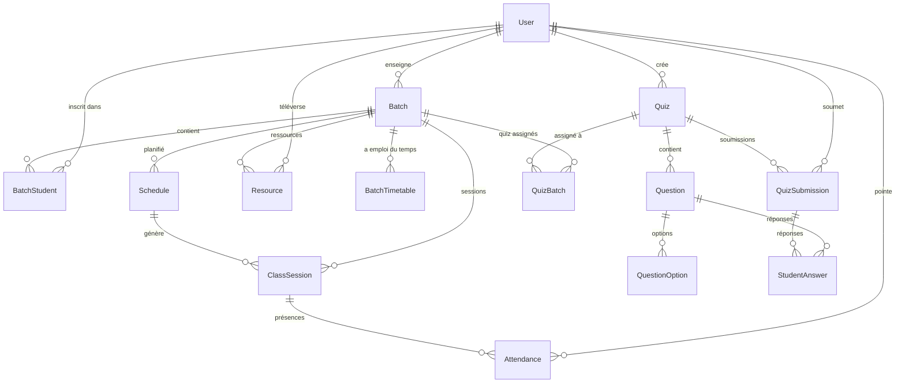

# Document de Conception — Plateforme SaaS Multi-Tenant d'Enseignement du Français

## Vue d'Ensemble

Ce document de conception décrit l'architecture technique de la plateforme SaaS multi-tenant d'enseignement du français. La plateforme remplace l'application monolithique existante (React SPA + Express.js + PostgreSQL) par une architecture moderne basée sur NestJS, Next.js, Prisma et PostgreSQL avec isolation par schéma. Le support bilingue (français/anglais) est intégré à tous les niveaux de l'architecture.

La fonctionnalité de chat est explicitement exclue.

### Objectifs Architecturaux

- Isolation complète des données par tenant via des schémas PostgreSQL dédiés
- Support de deux formules d'abonnement (Full et Lite) avec adaptation dynamique des fonctionnalités
- Personnalisation visuelle (branding) par tenant avec sous-domaine dédié
- Support bilingue natif (français et anglais) sur toute la stack
- Intégration Stripe pour la facturation récurrente
- Stockage objet (S3/R2) pour les fichiers et médias
- Cache Redis pour les performances et le rate limiting
- Architecture modulaire et maintenable en monorepo

### Diagramme d'Architecture Haut Niveau



## Architecture

### Architecture Multi-Tenant avec Isolation par Schéma

L'architecture repose sur un modèle d'isolation par schéma PostgreSQL. Chaque tenant dispose de son propre schéma contenant ses tables métier, tandis qu'un schéma `public` partagé stocke les données globales (tenants, abonnements, Super Admin).



#### Résolution de Tenant

Le flux de résolution de tenant fonctionne comme suit :



### Structure Monorepo

```
/
├── apps/
│   ├── backend/                    # NestJS API
│   │   ├── src/
│   │   │   ├── modules/
│   │   │   │   ├── auth/
│   │   │   │   ├── tenants/
│   │   │   │   ├── users/
│   │   │   │   ├── batches/
│   │   │   │   ├── quizzes/
│   │   │   │   ├── resources/
│   │   │   │   ├── schedules/
│   │   │   │   ├── attendance/
│   │   │   │   ├── subscriptions/
│   │   │   │   ├── demo-requests/
│   │   │   │   ├── email/
│   │   │   │   ├── storage/
│   │   │   │   └── scheduler/
│   │   │   ├── common/
│   │   │   │   ├── guards/
│   │   │   │   ├── decorators/
│   │   │   │   ├── filters/
│   │   │   │   ├── interceptors/
│   │   │   │   ├── pipes/
│   │   │   │   └── middleware/
│   │   │   ├── prisma/
│   │   │   │   ├── prisma.service.ts
│   │   │   │   ├── tenant-prisma.service.ts
│   │   │   │   └── schemas/
│   │   │   │       ├── public.prisma
│   │   │   │       └── tenant.prisma
│   │   │   └── i18n/
│   │   │       ├── fr.json
│   │   │       └── en.json
│   │   └── test/
│   │
│   └── frontend/                   # Next.js App Router
│       ├── src/
│       │   ├── app/
│       │   │   ├── [locale]/
│       │   │   │   ├── layout.tsx
│       │   │   │   ├── page.tsx
│       │   │   │   ├── (auth)/
│       │   │   │   │   └── login/
│       │   │   │   ├── (dashboard)/
│       │   │   │   │   ├── admin/
│       │   │   │   │   ├── teacher/
│       │   │   │   │   └── student/
│       │   │   │   └── (public)/
│       │   │   │       └── demo/
│       │   │   └── api/
│       │   │       └── auth/
│       │   ├── components/
│       │   │   ├── ui/              # shadcn/ui
│       │   │   ├── layout/
│       │   │   ├── forms/
│       │   │   └── dashboard/
│       │   ├── lib/
│       │   │   ├── auth.ts
│       │   │   ├── api-client.ts
│       │   │   └── tenant.ts
│       │   └── messages/
│       │       ├── fr.json
│       │       └── en.json
│       └── public/
│
└── packages/
    └── shared/                     # Types et utilitaires partagés
        ├── types/
        ├── constants/
        └── validators/
```


## Composants et Interfaces

### Backend — Modules NestJS

#### 1. Module Tenant (`tenants/`)

Responsable de la gestion du cycle de vie des tenants et de la résolution dynamique du schéma.

```typescript
// tenants/tenant-resolver.middleware.ts
@Injectable()
export class TenantResolverMiddleware implements NestMiddleware {
  constructor(
    private readonly redis: RedisService,
    private readonly prisma: PrismaService,
  ) {}

  async use(req: Request, res: Response, next: NextFunction) {
    const slug = this.extractSlug(req);
    if (!slug) return next(); // route publique (landing page)

    let tenant = await this.redis.get(`tenant:${slug}`);
    if (!tenant) {
      tenant = await this.prisma.public.tenant.findUnique({ where: { slug } });
      if (tenant) await this.redis.set(`tenant:${slug}`, tenant, 300); // TTL 5min
    }

    if (!tenant) throw new NotFoundException('Tenant introuvable');
    if (tenant.status === 'suspended') throw new ForbiddenException('Compte suspendu');

    req['tenant'] = tenant;
    req['tenantSchema'] = `tenant_${tenant.slug}`;
    next();
  }
}

// tenants/dto/create-tenant.dto.ts
export class CreateTenantDto {
  @IsString() @IsNotEmpty() name: string;
  @IsString() @Matches(/^[a-z0-9-]+$/) slug: string;
  @IsEnum(PlanType) plan: PlanType;
  @IsEmail() adminEmail: string;
  @IsOptional() @IsString() logoUrl?: string;
  @IsOptional() @IsString() primaryColor?: string;
  @IsOptional() @IsString() secondaryColor?: string;
  @IsOptional() @IsEnum(Locale) defaultLocale?: Locale; // 'fr' | 'en'
}
```

#### 2. Module Auth (`auth/`)

Authentification via NextAuth.js côté frontend avec validation JWT côté NestJS.

```typescript
// auth/auth.guard.ts
@Injectable()
export class JwtAuthGuard implements CanActivate {
  canActivate(context: ExecutionContext): boolean {
    const request = context.switchToHttp().getRequest();
    const token = this.extractToken(request);
    const payload = this.jwtService.verify(token);

    // Vérifier que le tenant du token correspond au tenant résolu
    if (payload.tenantId !== request['tenant']?.id) {
      throw new UnauthorizedException();
    }

    request['user'] = payload;
    return true;
  }
}

// auth/roles.guard.ts
@Injectable()
export class RolesGuard implements CanActivate {
  canActivate(context: ExecutionContext): boolean {
    const requiredRoles = this.reflector.get<Role[]>('roles', context.getHandler());
    const user = context.switchToHttp().getRequest()['user'];
    return requiredRoles.includes(user.role);
  }
}

// Décorateurs personnalisés
@SetMetadata('roles', [Role.ADMIN, Role.SUPER_ADMIN])
export const AdminOnly = () => SetMetadata('roles', [Role.ADMIN, Role.SUPER_ADMIN]);

@SetMetadata('roles', [Role.TEACHER])
export const TeacherOnly = () => SetMetadata('roles', [Role.TEACHER]);
```

#### 3. Module Prisma Multi-Schéma (`prisma/`)

Gestion dynamique des connexions Prisma avec sélection de schéma par tenant.

```typescript
// prisma/tenant-prisma.service.ts
@Injectable({ scope: Scope.REQUEST })
export class TenantPrismaService {
  private client: PrismaClient;

  constructor(@Inject(REQUEST) private request: Request) {}

  async getClient(): Promise<PrismaClient> {
    const schema = this.request['tenantSchema'];
    if (!this.client) {
      this.client = new PrismaClient();
      await this.client.$executeRawUnsafe(`SET search_path TO "${schema}", public`);
    }
    return this.client;
  }
}
```

#### 4. Module Email (`email/`)

Système d'emails transactionnels bilingues avec branding par tenant.

```typescript
// email/email.service.ts
@Injectable()
export class EmailService {
  constructor(
    private readonly brevo: BrevoService,
    private readonly i18n: I18nService,
    private readonly templateEngine: TemplateEngine,
  ) {}

  async sendWelcomeEmail(params: {
    to: string;
    firstName: string;
    tempPassword: string;
    tenant: Tenant;
    locale: Locale;
  }) {
    const subject = this.i18n.t('email.welcome.subject', params.locale);
    const html = this.templateEngine.render('welcome', {
      ...params,
      branding: params.tenant.branding,
      translations: this.i18n.getTranslations('email.welcome', params.locale),
    });
    await this.brevo.send({ to: params.to, subject, html });
  }
}
```

#### 5. Module Subscriptions (`subscriptions/`)

Intégration Stripe pour la gestion des abonnements.

```typescript
// subscriptions/stripe-webhook.controller.ts
@Controller('webhooks/stripe')
export class StripeWebhookController {
  @Post()
  async handleWebhook(@Req() req: RawBodyRequest<Request>) {
    const event = this.stripe.webhooks.constructEvent(
      req.rawBody, req.headers['stripe-signature'], this.webhookSecret
    );

    switch (event.type) {
      case 'invoice.payment_succeeded':
        await this.subscriptionService.renewSubscription(event.data.object);
        break;
      case 'invoice.payment_failed':
        await this.subscriptionService.handlePaymentFailure(event.data.object);
        break;
      case 'customer.subscription.deleted':
        await this.subscriptionService.handleCancellation(event.data.object);
        break;
    }
  }
}
```

#### 6. Module Storage (`storage/`)

Abstraction du stockage objet S3/R2 avec URLs signées.

```typescript
// storage/storage.service.ts
@Injectable()
export class StorageService {
  private s3: S3Client;

  async upload(file: Express.Multer.File, tenantSlug: string): Promise<string> {
    const key = `${tenantSlug}/${uuidv4()}-${file.originalname}`;
    await this.s3.send(new PutObjectCommand({
      Bucket: this.bucket,
      Key: key,
      Body: file.buffer,
      ContentType: file.mimetype,
    }));
    return key;
  }

  async getSignedUrl(key: string, expiresIn = 3600): Promise<string> {
    return getSignedUrl(this.s3, new GetObjectCommand({
      Bucket: this.bucket, Key: key,
    }), { expiresIn });
  }

  async delete(key: string): Promise<void> {
    await this.s3.send(new DeleteObjectCommand({
      Bucket: this.bucket, Key: key,
    }));
  }
}
```

### Frontend — Architecture Next.js

#### Middleware de Résolution Tenant et Locale

```typescript
// middleware.ts
import createMiddleware from 'next-intl/middleware';

export default async function middleware(request: NextRequest) {
  const hostname = request.headers.get('host') || '';
  const slug = hostname.split('.')[0];

  // Résolution du tenant
  if (slug && slug !== 'www' && slug !== 'app') {
    const tenant = await fetchTenantBySlug(slug);
    if (!tenant) return NextResponse.rewrite(new URL('/404', request.url));
    if (tenant.status === 'suspended') return NextResponse.rewrite(new URL('/suspended', request.url));

    // Injecter les infos tenant dans les headers
    const response = NextResponse.next();
    response.headers.set('x-tenant-id', tenant.id);
    response.headers.set('x-tenant-slug', tenant.slug);
    response.headers.set('x-tenant-locale', tenant.defaultLocale || 'fr');
  }

  // Gestion i18n via next-intl
  const handleI18n = createMiddleware({
    locales: ['fr', 'en'],
    defaultLocale: 'fr',
    localePrefix: 'as-needed', // /fr/dashboard → /dashboard (fr par défaut)
  });

  return handleI18n(request);
}
```

#### Provider de Tenant et Branding

```typescript
// lib/tenant-context.tsx
'use client';

interface TenantBranding {
  name: string;
  logoUrl: string | null;
  primaryColor: string;
  secondaryColor: string;
  defaultLocale: Locale;
}

const TenantContext = createContext<TenantBranding | null>(null);

export function TenantProvider({ children, branding }: {
  children: React.ReactNode;
  branding: TenantBranding;
}) {
  return (
    <TenantContext.Provider value={branding}>
      <style>{`
        :root {
          --primary: ${branding.primaryColor};
          --secondary: ${branding.secondaryColor};
        }
      `}</style>
      {children}
    </TenantContext.Provider>
  );
}
```


## Modèles de Données

### Schéma Public (données globales)

```prisma
// prisma/schemas/public.prisma
datasource db {
  provider = "postgresql"
  url      = env("DATABASE_URL")
}

generator client {
  provider = "prisma-client-js"
}

enum PlanType {
  FULL
  LITE
}

enum TenantStatus {
  ACTIVE
  GRACE_PERIOD
  SUSPENDED
  ARCHIVED
}

enum SubscriptionInterval {
  MONTHLY
  YEARLY
}

enum Locale {
  FR
  EN
}

enum DemoRequestStatus {
  PENDING
  CONTACTED
  SCHEDULED
  COMPLETED
  CANCELLED
}

model SuperAdmin {
  id           Int      @id @default(autoincrement())
  email        String   @unique
  passwordHash String   @map("password_hash")
  firstName    String   @map("first_name")
  lastName     String   @map("last_name")
  locale       Locale   @default(FR)
  createdAt    DateTime @default(now()) @map("created_at")
  updatedAt    DateTime @updatedAt @map("updated_at")

  @@map("super_admins")
}

model Tenant {
  id              Int          @id @default(autoincrement())
  name            String
  slug            String       @unique
  status          TenantStatus @default(ACTIVE)
  plan            PlanType
  schemaName      String       @unique @map("schema_name")
  defaultLocale   Locale       @default(FR) @map("default_locale")

  // Branding
  logoUrl         String?      @map("logo_url")
  primaryColor    String       @default("#1677ff") @map("primary_color")
  secondaryColor  String       @default("#52c41a") @map("secondary_color")
  displayName     String?      @map("display_name")

  // Stripe
  stripeCustomerId     String?  @unique @map("stripe_customer_id")
  stripeSubscriptionId String?  @unique @map("stripe_subscription_id")

  // Stockage
  storageUsedBytes  BigInt   @default(0) @map("storage_used_bytes")
  storageMaxBytes   BigInt   @default(5368709120) @map("storage_max_bytes") // 5 Go par défaut

  createdAt       DateTime @default(now()) @map("created_at")
  updatedAt       DateTime @updatedAt @map("updated_at")

  subscription    Subscription?
  auditLogs       AuditLog[]

  @@index([status])
  @@index([slug])
  @@map("tenants")
}

model Subscription {
  id              Int                  @id @default(autoincrement())
  tenantId        Int                  @unique @map("tenant_id")
  plan            PlanType
  interval        SubscriptionInterval @default(MONTHLY)
  status          String               @default("active")
  currentPeriodStart DateTime          @map("current_period_start")
  currentPeriodEnd   DateTime          @map("current_period_end")
  gracePeriodEnd     DateTime?         @map("grace_period_end")
  stripeSubscriptionId String?         @unique @map("stripe_subscription_id")
  stripePriceId    String?             @map("stripe_price_id")
  createdAt        DateTime            @default(now()) @map("created_at")
  updatedAt        DateTime            @updatedAt @map("updated_at")

  tenant           Tenant              @relation(fields: [tenantId], references: [id])

  @@index([status])
  @@index([currentPeriodEnd])
  @@map("subscriptions")
}

model Plan {
  id              Int      @id @default(autoincrement())
  type            PlanType @unique
  nameEn          String   @map("name_en")
  nameFr          String   @map("name_fr")
  descriptionEn   String?  @map("description_en")
  descriptionFr   String?  @map("description_fr")
  monthlyPrice    Decimal  @map("monthly_price")
  yearlyPrice     Decimal  @map("yearly_price")
  maxUsers        Int      @map("max_users")
  maxStorageBytes BigInt   @map("max_storage_bytes")
  stripePriceIdMonthly String? @map("stripe_price_id_monthly")
  stripePriceIdYearly  String? @map("stripe_price_id_yearly")
  features        Json     @default("{}") // { "batches": true, "adminRole": true, ... }
  createdAt       DateTime @default(now()) @map("created_at")

  @@map("plans")
}

model DemoRequest {
  id                  Int               @id @default(autoincrement())
  fullName            String            @map("full_name")
  email               String
  phone               String?
  country             String
  hasPreviousExperience String          @map("has_previous_experience")
  currentLevel        String            @map("current_level")
  previousStudyMethod String?           @map("previous_study_method")
  interestedLevel     String            @map("interested_level")
  learningGoals       String            @map("learning_goals")
  expectations        String?
  expectedStartTime   String            @map("expected_start_time")
  preferredSchedule   String            @map("preferred_schedule")
  timezone            String?
  status              DemoRequestStatus @default(PENDING)
  notes               String?
  assignedTeacherId   Int?              @map("assigned_teacher_id")
  assignedTenantId    Int?              @map("assigned_tenant_id")
  meetingLink         String?           @map("meeting_link")
  scheduledAt         DateTime?         @map("scheduled_at")
  contactedAt         DateTime?         @map("contacted_at")
  createdAt           DateTime          @default(now()) @map("created_at")
  updatedAt           DateTime          @updatedAt @map("updated_at")

  @@index([status])
  @@index([createdAt])
  @@map("demo_requests")
}

model AuditLog {
  id        Int      @id @default(autoincrement())
  tenantId  Int?     @map("tenant_id")
  userId    Int?     @map("user_id")
  action    String
  entity    String
  entityId  String?  @map("entity_id")
  details   Json?
  ipAddress String?  @map("ip_address")
  createdAt DateTime @default(now()) @map("created_at")

  tenant    Tenant?  @relation(fields: [tenantId], references: [id])

  @@index([tenantId, createdAt])
  @@index([action])
  @@map("audit_logs")
}
```

### Schéma Tenant (données isolées par tenant)

```prisma
// prisma/schemas/tenant.prisma

enum UserRole {
  ADMIN
  TEACHER
  STUDENT
}

enum Locale {
  FR
  EN
}

model User {
  id                  Int       @id @default(autoincrement())
  username            String    @unique
  email               String    @unique
  passwordHash        String    @map("password_hash")
  role                UserRole
  firstName           String    @map("first_name")
  lastName            String    @map("last_name")
  locale              Locale    @default(FR) // Préférence linguistique de l'utilisateur
  mustChangePassword  Boolean   @default(true) @map("must_change_password")
  passwordChangedAt   DateTime? @map("password_changed_at")
  passwordExpiresAt   DateTime? @map("password_expires_at")
  isActive            Boolean   @default(true) @map("is_active")
  failedLoginAttempts Int       @default(0) @map("failed_login_attempts")
  lastFailedLogin     DateTime? @map("last_failed_login")
  accountLockedUntil  DateTime? @map("account_locked_until")
  createdAt           DateTime  @default(now()) @map("created_at")
  updatedAt           DateTime  @updatedAt @map("updated_at")

  // Relations
  teacherBatches      Batch[]           @relation("TeacherBatches")
  enrollments         BatchStudent[]
  quizzesCreated      Quiz[]
  quizSubmissions     QuizSubmission[]
  resourcesCreated    Resource[]
  classSessions       ClassSession[]    @relation("TeacherSessions")
  attendanceRecords   Attendance[]
  emailChangeRequests EmailChangeRequest[]
  passwordResetRequests PasswordResetRequest[]

  @@index([role])
  @@index([email])
  @@index([isActive])
  @@map("users")
}

model Batch {
  id              Int       @id @default(autoincrement())
  name            String
  teacherId       Int       @map("teacher_id")
  frenchLevel     String    @map("french_level") // A1, A2, B1, B2, C1, C2
  startDate       DateTime  @map("start_date")
  endDate         DateTime  @map("end_date")
  locationMode    String    @default("online") @map("location_mode")
  timezone        String    @default("UTC")
  location        String?
  meetingLink     String?   @map("meeting_link")
  createdAt       DateTime  @default(now()) @map("created_at")
  updatedAt       DateTime  @updatedAt @map("updated_at")

  teacher         User      @relation("TeacherBatches", fields: [teacherId], references: [id])
  students        BatchStudent[]
  timetables      BatchTimetable[]
  schedules       Schedule[]
  classSessions   ClassSession[]
  quizBatches     QuizBatch[]
  resources       Resource[]

  @@index([teacherId])
  @@index([frenchLevel])
  @@map("batches")
}

model BatchStudent {
  id         Int      @id @default(autoincrement())
  batchId    Int      @map("batch_id")
  studentId  Int      @map("student_id")
  enrolledAt DateTime @default(now()) @map("enrolled_at")

  batch      Batch    @relation(fields: [batchId], references: [id], onDelete: Cascade)
  student    User     @relation(fields: [studentId], references: [id], onDelete: Cascade)

  @@unique([batchId, studentId])
  @@index([batchId])
  @@index([studentId])
  @@map("batch_students")
}

model BatchTimetable {
  id           Int      @id @default(autoincrement())
  batchId      Int      @map("batch_id")
  dayOfWeek    Int      @map("day_of_week") // 0=Dimanche, 6=Samedi
  startTime    String   @map("start_time")
  endTime      String   @map("end_time")
  timezone     String   @default("UTC")
  locationMode String   @default("online") @map("location_mode")
  location     String?
  link         String?
  isActive     Boolean  @default(true) @map("is_active")
  createdAt    DateTime @default(now()) @map("created_at")
  updatedAt    DateTime @updatedAt @map("updated_at")

  batch        Batch    @relation(fields: [batchId], references: [id], onDelete: Cascade)

  @@index([batchId, dayOfWeek])
  @@map("batch_timetables")
}

model Quiz {
  id                 Int       @id @default(autoincrement())
  title              String
  description        String?
  teacherId          Int       @map("teacher_id")
  status             String    @default("draft") // draft, published, closed
  startDate          DateTime? @map("start_date")
  endDate            DateTime? @map("end_date")
  durationMinutes    Int?      @map("duration_minutes")
  totalMarks         Decimal   @default(0) @map("total_marks")
  instructions       String?
  randomizeQuestions Boolean   @default(false) @map("randomize_questions")
  randomizeOptions   Boolean   @default(false) @map("randomize_options")
  autoSubmit         Boolean   @default(true) @map("auto_submit")
  createdAt          DateTime  @default(now()) @map("created_at")
  updatedAt          DateTime  @updatedAt @map("updated_at")

  teacher            User      @relation(fields: [teacherId], references: [id])
  questions          Question[]
  quizBatches        QuizBatch[]
  submissions        QuizSubmission[]
  remindersSent      QuizReminderSent[]

  @@index([teacherId, status])
  @@index([status])
  @@map("quizzes")
}

model Question {
  id            Int       @id @default(autoincrement())
  quizId        Int       @map("quiz_id")
  questionText  String    @map("question_text")
  questionType  String    @map("question_type") // multiple_choice, true_false, free_text
  questionOrder Int       @map("question_order")
  marks         Decimal   @default(1)
  correctAnswer String?   @map("correct_answer")
  explanation   String?
  createdAt     DateTime  @default(now()) @map("created_at")

  quiz          Quiz      @relation(fields: [quizId], references: [id], onDelete: Cascade)
  options       QuestionOption[]
  studentAnswers StudentAnswer[]

  @@index([quizId, questionOrder])
  @@map("questions")
}

model QuestionOption {
  id          Int      @id @default(autoincrement())
  questionId  Int      @map("question_id")
  optionText  String   @map("option_text")
  optionOrder Int      @map("option_order")
  isCorrect   Boolean  @default(false) @map("is_correct")
  createdAt   DateTime @default(now()) @map("created_at")

  question    Question @relation(fields: [questionId], references: [id], onDelete: Cascade)

  @@index([questionId, optionOrder])
  @@map("question_options")
}

model QuizBatch {
  id         Int      @id @default(autoincrement())
  quizId     Int      @map("quiz_id")
  batchId    Int      @map("batch_id")
  assignedAt DateTime @default(now()) @map("assigned_at")

  quiz       Quiz     @relation(fields: [quizId], references: [id], onDelete: Cascade)
  batch      Batch    @relation(fields: [batchId], references: [id], onDelete: Cascade)

  @@unique([quizId, batchId])
  @@map("quiz_batches")
}

model QuizSubmission {
  id                  Int       @id @default(autoincrement())
  quizId              Int       @map("quiz_id")
  studentId           Int       @map("student_id")
  status              String    @default("not_started")
  startedAt           DateTime? @map("started_at")
  submittedAt         DateTime? @map("submitted_at")
  timeTakenMinutes    Int?      @map("time_taken_minutes")
  totalScore          Decimal   @default(0) @map("total_score")
  maxScore            Decimal   @default(0) @map("max_score")
  percentage          Decimal   @default(0)
  autoSavedData       Json?     @map("auto_saved_data")
  createdAt           DateTime  @default(now()) @map("created_at")
  updatedAt           DateTime  @updatedAt @map("updated_at")

  quiz                Quiz      @relation(fields: [quizId], references: [id], onDelete: Cascade)
  student             User      @relation(fields: [studentId], references: [id], onDelete: Cascade)
  answers             StudentAnswer[]

  @@unique([quizId, studentId])
  @@index([studentId])
  @@index([quizId, status])
  @@map("quiz_submissions")
}

model StudentAnswer {
  id              Int       @id @default(autoincrement())
  submissionId    Int       @map("submission_id")
  questionId      Int       @map("question_id")
  answerText      String?   @map("answer_text")
  selectedOptions Json?     @map("selected_options")
  marksAwarded    Decimal   @default(0) @map("marks_awarded")
  isCorrect       Boolean   @default(false) @map("is_correct")
  createdAt       DateTime  @default(now()) @map("created_at")
  updatedAt       DateTime  @updatedAt @map("updated_at")

  submission      QuizSubmission @relation(fields: [submissionId], references: [id], onDelete: Cascade)
  question        Question       @relation(fields: [questionId], references: [id], onDelete: Cascade)

  @@unique([submissionId, questionId])
  @@map("student_answers")
}

model QuizReminderSent {
  id        Int      @id @default(autoincrement())
  quizId    Int      @unique @map("quiz_id")
  sentAt    DateTime @map("sent_at")
  createdAt DateTime @default(now()) @map("created_at")

  quiz      Quiz     @relation(fields: [quizId], references: [id], onDelete: Cascade)

  @@map("quiz_reminders_sent")
}

model Resource {
  id          Int      @id @default(autoincrement())
  title       String
  description String?
  fileName    String   @map("file_name")
  storageKey  String   @map("storage_key") // Clé S3/R2
  fileType    String   @map("file_type")
  fileSize    Int      @map("file_size")
  teacherId   Int      @map("teacher_id")
  batchId     Int?     @map("batch_id")
  createdAt   DateTime @default(now()) @map("created_at")

  teacher     User     @relation(fields: [teacherId], references: [id])
  batch       Batch?   @relation(fields: [batchId], references: [id], onDelete: Cascade)

  @@index([teacherId])
  @@index([batchId])
  @@map("resources")
}

model Schedule {
  id           Int       @id @default(autoincrement())
  title        String
  description  String?
  startTime    DateTime  @map("start_time")
  endTime      DateTime  @map("end_time")
  batchId      Int       @map("batch_id")
  teacherId    Int?      @map("teacher_id")
  locationMode String    @default("online") @map("location_mode")
  location     String?
  link         String?
  status       String    @default("scheduled") // scheduled, cancelled
  createdAt    DateTime  @default(now()) @map("created_at")
  updatedAt    DateTime  @updatedAt @map("updated_at")

  batch        Batch     @relation(fields: [batchId], references: [id], onDelete: Cascade)
  sessions     ClassSession[]

  @@index([batchId, startTime])
  @@index([status])
  @@map("schedules")
}

model ClassSession {
  id              Int       @id @default(autoincrement())
  scheduleId      Int       @map("schedule_id")
  batchId         Int       @map("batch_id")
  teacherId       Int       @map("teacher_id")
  sessionDate     DateTime  @map("session_date") @db.Date
  startTime       DateTime  @map("start_time")
  endTime         DateTime  @map("end_time")
  accessCode      String?   @map("access_code")
  codeGeneratedAt DateTime? @map("code_generated_at")
  codeExpiresAt   DateTime? @map("code_expires_at")
  sessionStartedAt DateTime? @map("session_started_at")
  sessionEndedAt  DateTime? @map("session_ended_at")
  status          String    @default("scheduled") // scheduled, in_progress, completed
  createdAt       DateTime  @default(now()) @map("created_at")
  updatedAt       DateTime  @updatedAt @map("updated_at")

  schedule        Schedule  @relation(fields: [scheduleId], references: [id], onDelete: Cascade)
  batch           Batch     @relation(fields: [batchId], references: [id], onDelete: Cascade)
  teacher         User      @relation("TeacherSessions", fields: [teacherId], references: [id])
  attendanceRecords Attendance[]

  @@unique([scheduleId, sessionDate])
  @@index([batchId])
  @@index([status])
  @@map("class_sessions")
}

model Attendance {
  id          Int       @id @default(autoincrement())
  sessionId   Int       @map("session_id")
  studentId   Int       @map("student_id")
  status      String    @default("absent") // present, absent, late
  checkInTime DateTime? @map("check_in_time")
  notes       String?
  createdAt   DateTime  @default(now()) @map("created_at")
  updatedAt   DateTime  @updatedAt @map("updated_at")

  session     ClassSession @relation(fields: [sessionId], references: [id], onDelete: Cascade)
  student     User         @relation(fields: [studentId], references: [id], onDelete: Cascade)

  @@unique([sessionId, studentId])
  @@map("attendance")
}

model EmailChangeRequest {
  id          Int      @id @default(autoincrement())
  userId      Int      @map("user_id")
  oldEmail    String   @map("old_email")
  newEmail    String   @map("new_email")
  code        String
  attempts    Int      @default(0)
  maxAttempts Int      @default(3) @map("max_attempts")
  status      String   @default("pending")
  expiresAt   DateTime @map("expires_at")
  createdAt   DateTime @default(now()) @map("created_at")
  updatedAt   DateTime @updatedAt @map("updated_at")

  user        User     @relation(fields: [userId], references: [id], onDelete: Cascade)

  @@index([userId, status])
  @@map("email_change_requests")
}

model PasswordResetRequest {
  id          Int      @id @default(autoincrement())
  userId      Int      @map("user_id")
  email       String
  code        String
  attempts    Int      @default(0)
  maxAttempts Int      @default(3) @map("max_attempts")
  status      String   @default("pending")
  expiresAt   DateTime @map("expires_at")
  createdAt   DateTime @default(now()) @map("created_at")
  updatedAt   DateTime @updatedAt @map("updated_at")

  user        User     @relation(fields: [userId], references: [id], onDelete: Cascade)

  @@index([userId, status])
  @@map("password_reset_requests")
}

model TenantSetting {
  id        Int      @id @default(autoincrement())
  key       String   @unique
  value     String
  type      String   @default("string") // string, number, boolean
  createdAt DateTime @default(now()) @map("created_at")
  updatedAt DateTime @updatedAt @map("updated_at")

  @@map("tenant_settings")
}
```

### Diagramme Entité-Relation (Schéma Tenant)




## Propriétés de Correction

Les propriétés suivantes définissent les invariants formels que la plateforme doit respecter. Elles serviront de base aux tests property-based pour valider la conformité de l'implémentation.

### Propriété 1 : Isolation des Données Multi-Tenant

**Exigences liées :** Exigence 1, Exigence 19

**Propriété :** Pour tout tenant T1 et T2 où T1 ≠ T2, toute requête exécutée dans le contexte de T1 ne doit jamais retourner, modifier ou supprimer des données appartenant au schéma de T2.

**Formellement :**
```
∀ T1, T2 ∈ Tenants, T1 ≠ T2 :
  ∀ query Q exécutée avec search_path = schema(T1) :
    resultSet(Q) ∩ data(schema(T2)) = ∅
```

**Stratégie de test :** Générer aléatoirement des paires de tenants avec des données, exécuter des requêtes CRUD dans le contexte d'un tenant et vérifier qu'aucune donnée de l'autre tenant n'est accessible ou modifiée.

### Propriété 2 : Résolution de Tenant Déterministe

**Exigences liées :** Exigence 1, Exigence 4

**Propriété :** Pour tout sous-domaine valide S, la résolution de tenant doit toujours retourner le même tenant T, et pour tout sous-domaine invalide, la résolution doit retourner une erreur 404.

**Formellement :**
```
∀ slug S :
  SI ∃ T ∈ Tenants tel que T.slug = S ET T.status ∈ {ACTIVE, GRACE_PERIOD} :
    resolve(S) = T
  SINON :
    resolve(S) = Erreur(404)
```

**Stratégie de test :** Générer des slugs aléatoires (valides et invalides) et vérifier la cohérence de la résolution avec et sans cache Redis.

### Propriété 3 : Enforcement des Formules d'Abonnement

**Exigences liées :** Exigence 2, Exigence 6, Exigence 7

**Propriété :** Un tenant en Formule_Lite ne doit jamais pouvoir accéder aux fonctionnalités réservées à la Formule_Full (gestion Admin, lots/batches), et inversement un tenant en Formule_Full doit toujours avoir accès à la hiérarchie complète.

**Formellement :**
```
∀ T ∈ Tenants :
  SI T.plan = LITE :
    canAccess(T, "admin_management") = false
    canAccess(T, "batch_management") = false
    canAccess(T, "admin_dashboard") = false
  SI T.plan = FULL :
    canAccess(T, "admin_management") = true
    canAccess(T, "batch_management") = true
    canAccess(T, "admin_dashboard") = true
```

**Stratégie de test :** Générer des tenants avec des plans aléatoires et vérifier que les endpoints protégés retournent 403 pour les plans non autorisés.

### Propriété 4 : Contrôle d'Accès Basé sur les Rôles (RBAC)

**Exigences liées :** Exigence 5, Exigence 6

**Propriété :** Un utilisateur avec un rôle R ne doit jamais pouvoir accéder à une ressource ou exécuter une action réservée à un rôle R' où R' ∉ permissions(R).

**Formellement :**
```
∀ user U, action A :
  SI requiredRoles(A) ∩ {U.role} = ∅ :
    execute(U, A) = Erreur(403)
  SINON :
    execute(U, A) = Succès
```

**Stratégie de test :** Générer des combinaisons aléatoires (utilisateur, rôle, endpoint) et vérifier que seuls les rôles autorisés obtiennent un accès.

### Propriété 5 : Intégrité du Calcul des Scores de Quiz

**Exigences liées :** Exigence 8

**Propriété :** Pour toute soumission de quiz, le score total calculé doit être égal à la somme des points attribués à chaque réponse, et le pourcentage doit être (score / maxScore) × 100.

**Formellement :**
```
∀ submission S :
  S.totalScore = Σ(answer.marksAwarded pour answer ∈ S.answers)
  S.maxScore = Σ(question.marks pour question ∈ S.quiz.questions)
  S.percentage = (S.totalScore / S.maxScore) × 100
  0 ≤ S.totalScore ≤ S.maxScore
```

**Stratégie de test :** Générer des quiz avec des questions aléatoires (types variés, points variés), simuler des réponses aléatoires et vérifier la cohérence du calcul.

### Propriété 6 : Correction Automatique des Questions Objectives

**Exigences liées :** Exigence 8

**Propriété :** Pour toute question de type choix multiple ou vrai/faux, la correction automatique doit attribuer le score maximal si et seulement si la réponse correspond exactement aux options correctes.

**Formellement :**
```
∀ question Q de type {multiple_choice, true_false}, réponse R :
  SI R.selectedOptions = Q.correctOptions :
    R.marksAwarded = Q.marks ET R.isCorrect = true
  SINON :
    R.marksAwarded = 0 ET R.isCorrect = false
```

**Stratégie de test :** Générer des questions avec des options correctes aléatoires, simuler des réponses correctes et incorrectes, vérifier la notation.

### Propriété 7 : Intégrité du Système de Présence

**Exigences liées :** Exigence 11

**Propriété :** Un étudiant ne peut pointer sa présence que si le code d'accès est valide et non expiré, et chaque étudiant ne peut pointer qu'une seule fois par session.

**Formellement :**
```
∀ session S, étudiant E, code C :
  SI C = S.accessCode ET now() ≤ S.codeExpiresAt ET S.status = "in_progress" :
    checkIn(E, S, C) = Succès
    |{a ∈ Attendance : a.sessionId = S.id ET a.studentId = E.id}| = 1
  SINON :
    checkIn(E, S, C) = Erreur
```

**Stratégie de test :** Générer des sessions avec des codes et des fenêtres de validité aléatoires, simuler des tentatives de pointage avec des codes valides/invalides/expirés.

### Propriété 8 : Sécurité des Mots de Passe

**Exigences liées :** Exigence 5, Exigence 13

**Propriété :** Les mots de passe ne sont jamais stockés en clair, le verrouillage de compte se déclenche après exactement 5 échecs consécutifs, et les mots de passe expirent après 90 jours.

**Formellement :**
```
∀ user U :
  U.passwordHash ≠ plaintext(U.password)
  bcrypt.verify(plaintext, U.passwordHash) = true

∀ user U avec failedLoginAttempts = 5 :
  U.accountLockedUntil = lastFailedLogin + 30 minutes

∀ user U :
  SI now() > U.passwordExpiresAt :
    U.mustChangePassword = true
```

**Stratégie de test :** Générer des mots de passe aléatoires, vérifier le hachage bcrypt, simuler des séquences d'échecs de connexion et vérifier le verrouillage.

### Propriété 9 : Cycle de Vie des Abonnements

**Exigences liées :** Exigence 2

**Propriété :** Le statut d'un tenant suit un automate fini déterministe : ACTIVE → GRACE_PERIOD (à l'expiration) → SUSPENDED (après 15 jours de grâce) → ARCHIVED (sur suppression).

**Formellement :**
```
∀ tenant T :
  transitions_valides = {
    ACTIVE → GRACE_PERIOD,
    ACTIVE → SUSPENDED,
    GRACE_PERIOD → ACTIVE,
    GRACE_PERIOD → SUSPENDED,
    SUSPENDED → ACTIVE,
    SUSPENDED → ARCHIVED
  }
  ∀ transition (état_actuel → nouvel_état) :
    (état_actuel, nouvel_état) ∈ transitions_valides
```

**Stratégie de test :** Générer des séquences aléatoires de transitions d'état et vérifier que seules les transitions valides sont acceptées.

### Propriété 10 : Support Bilingue Complet (Français/Anglais)

**Exigences liées :** Exigence 23, Exigence 18

**Propriété :** Pour toute clé de traduction K et toute locale L ∈ {fr, en}, une traduction doit exister. Toute chaîne affichée à l'utilisateur doit être dans la locale sélectionnée. Les messages d'erreur API doivent respecter la locale de la requête.

**Formellement :**
```
∀ clé K ∈ TranslationKeys :
  ∀ locale L ∈ {fr, en} :
    translate(K, L) ≠ undefined ET translate(K, L) ≠ ""

∀ requête R avec locale L :
  ∀ message M dans response(R) :
    language(M) = L

∀ email E envoyé à user U :
  language(E.subject) = U.locale
  language(E.body) = U.locale
```

**Stratégie de test :** Parcourir toutes les clés de traduction et vérifier qu'elles existent dans les deux locales. Envoyer des requêtes avec des locales alternées et vérifier la langue des réponses.

### Propriété 11 : Branding par Tenant dans les Emails

**Exigences liées :** Exigence 12, Exigence 4

**Propriété :** Tout email transactionnel envoyé dans le contexte d'un tenant T doit contenir le branding de T (logo, couleurs, nom) et jamais le branding d'un autre tenant.

**Formellement :**
```
∀ email E envoyé dans le contexte du tenant T :
  E.html contient T.branding.displayName
  E.html contient T.branding.primaryColor
  SI T.branding.logoUrl ≠ null :
    E.html contient T.branding.logoUrl
  ∀ T' ∈ Tenants, T' ≠ T :
    E.html ne contient PAS T'.branding.logoUrl (si distinct)
```

**Stratégie de test :** Générer des tenants avec des brandings distincts, déclencher l'envoi d'emails et vérifier le contenu HTML.

### Propriété 12 : Isolation du Stockage Fichiers par Tenant

**Exigences liées :** Exigence 20

**Propriété :** Tout fichier téléversé par un tenant T doit être stocké avec un préfixe de chemin contenant l'identifiant de T, et les URLs signées ne doivent donner accès qu'aux fichiers du tenant demandeur.

**Formellement :**
```
∀ fichier F téléversé par tenant T :
  F.storageKey commence par T.slug + "/"

∀ requête de téléchargement R par tenant T pour fichier F :
  SI F.storageKey commence par T.slug + "/" :
    getSignedUrl(F) = URL valide
  SINON :
    getSignedUrl(F) = Erreur(403)
```

**Stratégie de test :** Téléverser des fichiers pour des tenants aléatoires et vérifier les préfixes de chemin. Tenter d'accéder aux fichiers d'un autre tenant.

### Propriété 13 : Idempotence des Webhooks Stripe

**Exigences liées :** Exigence 2

**Propriété :** Le traitement d'un même événement Stripe webhook doit être idempotent : traiter le même événement deux fois ne doit pas modifier l'état du système au-delà du premier traitement.

**Formellement :**
```
∀ événement Stripe E :
  état_après_1 = processWebhook(état_initial, E)
  état_après_2 = processWebhook(état_après_1, E)
  état_après_1 = état_après_2
```

**Stratégie de test :** Générer des événements Stripe simulés, les traiter deux fois et vérifier que l'état de la base de données est identique.

### Propriété 14 : Rate Limiting

**Exigences liées :** Exigence 19

**Propriété :** Toute IP dépassant le seuil de requêtes configuré doit recevoir une erreur 429, et les requêtes sous le seuil doivent être traitées normalement.

**Formellement :**
```
∀ IP I, fenêtre de temps W :
  SI count(requêtes de I dans W) > seuil(endpoint) :
    response = Erreur(429)
  SINON :
    response = traitement normal

Seuils :
  global = 100 requêtes / minute
  auth_endpoints = 10 requêtes / minute
```

**Stratégie de test :** Simuler des rafales de requêtes depuis des IPs aléatoires et vérifier que le rate limiting se déclenche au bon seuil.

### Propriété 15 : Unicité des Identifiants par Tenant

**Exigences liées :** Exigence 6, Exigence 16

**Propriété :** Au sein d'un même tenant, il ne peut exister deux utilisateurs avec le même email ou le même nom d'utilisateur.

**Formellement :**
```
∀ tenant T :
  ∀ U1, U2 ∈ Users(T), U1 ≠ U2 :
    U1.email ≠ U2.email
    U1.username ≠ U2.username
```

**Stratégie de test :** Tenter de créer des utilisateurs avec des emails/usernames dupliqués dans le même tenant et vérifier le rejet. Vérifier que le même email peut exister dans deux tenants différents.

### Propriété 16 : Cohérence de la Pagination

**Exigences liées :** Exigence 21

**Propriété :** Pour toute liste paginée, l'union de toutes les pages doit être égale à l'ensemble complet des résultats, sans doublons ni éléments manquants.

**Formellement :**
```
∀ requête paginée Q avec total N éléments :
  pages = ceil(N / pageSize)
  ∀ i ∈ [1, pages] :
    |page(i)| ≤ pageSize
  union(page(1), ..., page(pages)) = ensemble_complet
  ∀ i ≠ j : page(i) ∩ page(j) = ∅
```

**Stratégie de test :** Générer des ensembles de données de taille aléatoire, paginer et vérifier la complétude et l'absence de doublons.

### Propriété 17 : Validation des Mots de Passe

**Exigences liées :** Exigence 13

**Propriété :** Tout nouveau mot de passe doit respecter les critères de complexité : minimum 8 caractères, au moins une majuscule, une minuscule et un chiffre.

**Formellement :**
```
∀ mot de passe P accepté par le système :
  length(P) ≥ 8
  ∃ c ∈ P : isUpperCase(c)
  ∃ c ∈ P : isLowerCase(c)
  ∃ c ∈ P : isDigit(c)

∀ mot de passe P ne respectant pas ces critères :
  setPassword(P) = Erreur(validation)
```

**Stratégie de test :** Générer des mots de passe aléatoires (valides et invalides) et vérifier l'acceptation/rejet.

### Propriété 18 : Fin Automatique des Sessions Expirées

**Exigences liées :** Exigence 11, Exigence 22

**Propriété :** Toute session de cours dont l'heure de fin est dépassée doit être automatiquement terminée par la tâche planifiée, et les étudiants n'ayant pas pointé doivent être marqués absents.

**Formellement :**
```
∀ session S avec S.status = "in_progress" ET now() > S.endTime + tolérance :
  après exécution du scheduler :
    S.status = "completed"
    ∀ étudiant E inscrit dans S.batch :
      SI ¬∃ attendance A : A.sessionId = S.id ET A.studentId = E.id :
        ∃ attendance A' : A'.sessionId = S.id ET A'.studentId = E.id ET A'.status = "absent"
```

**Stratégie de test :** Créer des sessions avec des heures de fin dans le passé, exécuter le scheduler et vérifier les statuts.
