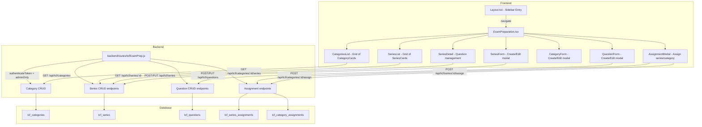

# Design Document: TCF Exam Preparation

## Overview

This feature adds admin-side management for the TCF Canada exam preparation module. It introduces five new database tables (one generic for categories, four CE-specific), a new Express.js route file mounted at `/api/tcf`, and a new React admin page at `/app/exam-preparation`.

The admin flow is: **Exam Preparation (sidebar)** → **Categories page** (grid of category cards) → **Click Compréhension Écrite** → **Series list** → **Click a series** → **Questions management**. "Compréhension Écrite" is seeded as the default category. The admin can create additional categories, but only Compréhension Écrite has its series/questions structure implemented in this phase. Each category will have its own unique content structure — other categories will be built in future phases.

Each CE series is a comprehensive exam containing questions from ALL CEFR levels (A1 through C2). When a student completes a series quiz, their achieved CEFR level is determined by their total score compared against configurable point thresholds defined on the series.

The design follows existing codebase patterns:
- Backend: Express router with `authenticateToken` + `adminOnly` middleware, PostgreSQL via `req.db`
- Frontend: React + TypeScript + Ant Design, using `apiCall()` from `useAuth()` context

## Architecture



### Request Flow

1. Admin clicks "Exam Preparation" in sidebar → navigates to `/app/exam-preparation`
2. `ExamPreparation.tsx` loads, fetches `GET /api/tcf/categories` → renders category cards
3. Admin clicks a category → fetches `GET /api/tcf/categories/:id/series` → renders series cards
4. Admin clicks a series → fetches `GET /api/tcf/series/:id` → renders question table
5. CRUD operations follow: frontend modal → API call → DB operation → refresh UI

## Components and Interfaces

### Backend

#### Route File: `backend/routes/tcfExamPrep.js`

Mounted in `server.js` as:
```js
const tcfExamPrepRoutes = require('./routes/tcfExamPrep');
app.use('/api/tcf', tcfExamPrepRoutes);
```

All endpoints use `authenticateToken` + `adminOnly` middleware.

**Category Endpoints:**

| Method | Path | Description |
|--------|------|-------------|
| GET | `/categories` | List all categories with series count, ordered by display_order |
| POST | `/categories` | Create a new category (name required, unique) |
| PUT | `/categories/:id` | Update category name, description, icon |
| DELETE | `/categories/:id` | Delete category (cascades to series, questions, assignments) |

**Series Endpoints:**

| Method | Path | Description |
|--------|------|-------------|
| GET | `/categories/:categoryId/series` | List all series for a category with question counts, CEFR distribution |
| POST | `/categories/:categoryId/series` | Create a new series within a category |
| GET | `/series/:id` | Get series detail with all questions, thresholds, CEFR distribution |
| PUT | `/series/:id` | Update series metadata including thresholds |
| DELETE | `/series/:id` | Delete series (cascades to questions) |

**Question Endpoints:**

| Method | Path | Description |
|--------|------|-------------|
| POST | `/series/:id/questions` | Add question to series |
| PUT | `/questions/:id` | Update a question |
| DELETE | `/questions/:id` | Delete question, reindex remaining |
| PUT | `/series/:id/questions/reorder` | Bulk update question order indices |

**Assignment Endpoints:**

| Method | Path | Description |
|--------|------|-------------|
| POST | `/series/:id/assign` | Assign series to student or batch |
| GET | `/series/:id/assignments` | List assignments for a series |
| DELETE | `/assignments/:id` | Remove a series assignment |
| POST | `/categories/:id/assign` | Assign entire category to student or batch |
| GET | `/categories/:id/assignments` | List category assignments |
| DELETE | `/category-assignments/:id` | Remove a category assignment |

#### Validation Rules

- **Category creation/update**: `name` required (min 1 char, unique), `description` optional, `icon` optional
- **Series creation/update**: `name` required (min 1 char), `duration_minutes` required (integer ≥ 1), `description` optional, `cefr_thresholds` required (JSON object with keys A1, A2, B1, B2, C1, C2 — all values must be non-negative numbers in ascending order)
- **Question creation/update**: `question_text` required, `option_a/b/c/d` all required (non-empty), `correct_answer` required (one of A/B/C/D), `cefr_level` required (one of A1/A2/B1/B2/C1/C2), `points` required (numeric ≥ 0)
- **Assignment**: exactly one of `student_id` or `batch_id` must be provided
- Invalid requests return 400, duplicates return 409

#### Response Formats

**Series list item:**
```json
{
  "id": 1,
  "name": "Série 1",
  "description": "Questions de compréhension...",
  "duration_minutes": 60,
  "total_questions": 29,
  "total_points": 699,
  "cefr_thresholds": { "A1": 100, "A2": 200, "B1": 300, "B2": 400, "C1": 500, "C2": 600 },
  "cefr_distribution": { "A1": 3, "A2": 5, "B1": 8, "B2": 7, "C1": 4, "C2": 2 },
  "created_by": 1,
  "created_at": "2025-01-15T10:00:00Z",
  "updated_at": "2025-01-15T10:00:00Z"
}
```

**Series detail (with questions):**
```json
{
  "id": 1,
  "name": "Série 1",
  "description": "...",
  "duration_minutes": 60,
  "total_questions": 2,
  "total_points": 3,
  "cefr_thresholds": { "A1": 100, "A2": 200, "B1": 300, "B2": 400, "C1": 500, "C2": 600 },
  "cefr_distribution": { "A1": 1, "A2": 0, "B1": 1, "B2": 0, "C1": 0, "C2": 0 },
  "questions": [
    {
      "id": 1,
      "question_order": 1,
      "question_text": "Lisez le texte suivant...",
      "image_url": null,
      "option_a": "...",
      "option_b": "...",
      "option_c": "...",
      "option_d": "...",
      "correct_answer": "B",
      "cefr_level": "A1",
      "points": 1
    },
    {
      "id": 2,
      "question_order": 2,
      "question_text": "Quel est le sens de...",
      "image_url": null,
      "option_a": "...",
      "option_b": "...",
      "option_c": "...",
      "option_d": "...",
      "correct_answer": "C",
      "cefr_level": "B1",
      "points": 2
    }
  ]
}
```

### Frontend

#### New Component: `frontend/src/components/Admin/ExamPreparation.tsx`

Single-file component managing the full admin workflow with internal state for view switching.

**State machine:**
- `view: 'categories' | 'series-list' | 'series-detail'` — three-level navigation
- `selectedCategoryId: number | null` — which category is open
- `selectedSeriesId: number | null` — which series is open for detail view

**Sub-components (inline or extracted as needed):**

1. **CategoryCard** — Displays category name, description, series count, icon. Click navigates to series list. Actions dropdown for edit/delete/assign.

2. **CategoryFormModal** — Ant Design Modal with Form for creating/editing a category. Fields: name (Input, required, unique), description (TextArea), icon (Select).

3. **SeriesCard** — Displays series name, total question count, total points, duration, and CEFR distribution as small colored tags. Click opens detail view. Actions dropdown for edit/delete/assign.

4. **SeriesFormModal** — Ant Design Modal with Form for creating/editing a series. Fields: name (Input), description (TextArea), duration_minutes (InputNumber), and a CEFR Thresholds configuration section with six InputNumber fields (A1–C2). Thresholds must be in ascending order.

5. **QuestionList** — Table of questions within a series, ordered by question_order. Supports drag-and-drop reorder.

6. **QuestionFormModal** — Modal with Form for creating/editing a question. Fields: question_text (TextArea), image upload (Upload), option_a/b/c/d (Input), correct_answer (Radio A/B/C/D), cefr_level (Select), points (InputNumber).

7. **AssignmentModal** — Modal for assigning a series or a category. Two tabs: "Students" and "Batches". Searchable lists with checkboxes. Shows existing assignments with remove buttons.

**Breadcrumb navigation:**
- Categories view: "Exam Preparation"
- Series list: "Exam Preparation > [Category Name]"
- Series detail: "Exam Preparation > [Category Name] > [Series Name]"

#### Routing Changes

In `App.tsx`, add inside the admin routes block:
```tsx
<Route path="exam-preparation" element={
  <ProtectedRoute requiredRole="admin">
    <ExamPreparation />
  </ProtectedRoute>
} />
```

#### Sidebar Changes

In `Layout.tsx`, add to the admin nav items array:
```ts
{ key: '/app/exam-preparation', icon: <ReadOutlined />, label: 'Exam Preparation' }
```

Import `ReadOutlined` from `@ant-design/icons`.

#### Page Title Mapping

In `Layout.tsx` `getPageTitle` MAP, add:
```ts
'/exam-preparation': 'Exam Preparation'
```

## Data Models

### Database Tables

#### `tcf_categories`

```sql
CREATE TABLE tcf_categories (
    id SERIAL PRIMARY KEY,
    name VARCHAR(200) NOT NULL UNIQUE,
    description TEXT,
    icon VARCHAR(50),
    display_order INTEGER DEFAULT 0,
    created_at TIMESTAMP DEFAULT CURRENT_TIMESTAMP,
    updated_at TIMESTAMP DEFAULT CURRENT_TIMESTAMP
);

-- Seed default categories
INSERT INTO tcf_categories (name, description, icon, display_order)
VALUES ('Compréhension Écrite', 'Reading comprehension — TCF Canada', 'ReadOutlined', 1);
INSERT INTO tcf_categories (name, description, icon, display_order)
VALUES ('Expression Écrite', 'Written expression — TCF Canada', 'EditOutlined', 2);
```

#### `tcf_ce_series`

```sql
CREATE TABLE tcf_ce_series (
    id SERIAL PRIMARY KEY,
    category_id INTEGER NOT NULL REFERENCES tcf_categories(id) ON DELETE CASCADE,
    name VARCHAR(200) NOT NULL,
    description TEXT,
    duration_minutes INTEGER NOT NULL,
    total_questions INTEGER DEFAULT 0,
    total_points NUMERIC DEFAULT 0,
    cefr_thresholds JSONB NOT NULL DEFAULT '{"A1": 0, "A2": 0, "B1": 0, "B2": 0, "C1": 0, "C2": 0}',
    created_by INTEGER REFERENCES users(id) ON DELETE SET NULL,
    created_at TIMESTAMP DEFAULT CURRENT_TIMESTAMP,
    updated_at TIMESTAMP DEFAULT CURRENT_TIMESTAMP
);

CREATE INDEX idx_tcf_ce_series_category ON tcf_ce_series(category_id);
```

The `cefr_thresholds` column stores a JSON object mapping each CEFR level to the minimum points required. The highest threshold met determines the achieved level.

#### `tcf_ce_questions`

```sql
CREATE TABLE tcf_ce_questions (
    id SERIAL PRIMARY KEY,
    series_id INTEGER NOT NULL REFERENCES tcf_ce_series(id) ON DELETE CASCADE,
    question_order INTEGER NOT NULL,
    image_url TEXT,
    question_text TEXT NOT NULL,
    option_a TEXT NOT NULL,
    option_b TEXT NOT NULL,
    option_c TEXT NOT NULL,
    option_d TEXT NOT NULL,
    correct_answer VARCHAR(1) NOT NULL CHECK (correct_answer IN ('A', 'B', 'C', 'D')),
    cefr_level VARCHAR(2) NOT NULL CHECK (cefr_level IN ('A1', 'A2', 'B1', 'B2', 'C1', 'C2')),
    points NUMERIC NOT NULL DEFAULT 1,
    created_at TIMESTAMP DEFAULT CURRENT_TIMESTAMP,
    updated_at TIMESTAMP DEFAULT CURRENT_TIMESTAMP
);

CREATE INDEX idx_tcf_ce_questions_series ON tcf_ce_questions(series_id);
CREATE INDEX idx_tcf_ce_questions_series_order ON tcf_ce_questions(series_id, question_order);
```

#### `tcf_ce_series_assignments`

```sql
CREATE TABLE tcf_ce_series_assignments (
    id SERIAL PRIMARY KEY,
    series_id INTEGER NOT NULL REFERENCES tcf_ce_series(id) ON DELETE CASCADE,
    student_id INTEGER REFERENCES users(id) ON DELETE CASCADE,
    batch_id INTEGER REFERENCES batches(id) ON DELETE CASCADE,
    assigned_at TIMESTAMP DEFAULT CURRENT_TIMESTAMP,
    CHECK (
        (student_id IS NOT NULL AND batch_id IS NULL) OR
        (student_id IS NULL AND batch_id IS NOT NULL)
    )
);

CREATE UNIQUE INDEX idx_tcf_ce_series_assign_student ON tcf_ce_series_assignments(series_id, student_id) WHERE student_id IS NOT NULL;
CREATE UNIQUE INDEX idx_tcf_ce_series_assign_batch ON tcf_ce_series_assignments(series_id, batch_id) WHERE batch_id IS NOT NULL;
```

#### `tcf_category_assignments`

```sql
CREATE TABLE tcf_category_assignments (
    id SERIAL PRIMARY KEY,
    category_id INTEGER NOT NULL REFERENCES tcf_categories(id) ON DELETE CASCADE,
    student_id INTEGER REFERENCES users(id) ON DELETE CASCADE,
    batch_id INTEGER REFERENCES batches(id) ON DELETE CASCADE,
    assigned_at TIMESTAMP DEFAULT CURRENT_TIMESTAMP,
    CHECK (
        (student_id IS NOT NULL AND batch_id IS NULL) OR
        (student_id IS NULL AND batch_id IS NOT NULL)
    )
);

CREATE UNIQUE INDEX idx_tcf_ce_cat_assign_student ON tcf_ce_category_assignments(student_id) WHERE student_id IS NOT NULL;
CREATE UNIQUE INDEX idx_tcf_ce_cat_assign_batch ON tcf_ce_category_assignments(batch_id) WHERE batch_id IS NOT NULL;
```

### Key Data Integrity Rules

- Deleting a series cascades to its questions and series assignments
- Deleting a user cascades to their assignments
- Deleting a batch cascades to its assignments
- `total_questions` and `total_points` on `tcf_ce_series` are denormalized counters updated by the backend after question add/edit/delete operations
- `cefr_thresholds` must always contain all six CEFR levels (A1–C2) with values in ascending order
- The CHECK constraint on assignments ensures exactly one of student_id or batch_id is set
- Partial unique indexes prevent duplicate assignments while allowing NULLs


## Correctness Properties

*A property is a characteristic or behavior that should hold true across all valid executions of a system — essentially, a formal statement about what the system should do. Properties serve as the bridge between human-readable specifications and machine-verifiable correctness guarantees.*

### Property 1: Series CRUD round-trip

*For any* valid series data (non-empty name, positive duration, valid CEFR thresholds in ascending order), creating a series via POST and then retrieving it via GET should return a series with the same name, description, duration_minutes, and cefr_thresholds. Similarly, updating a series via PUT and then retrieving it should reflect the updated values.

**Validates: Requirements 1.3, 1.7**

### Property 2: Series cascade deletion removes all questions

*For any* series containing one or more questions, deleting the series should result in both the series and all its associated questions being absent from the database.

**Validates: Requirements 1.9**

### Property 3: Series counter invariant

*For any* series, the `total_questions` field should always equal the count of questions in `tcf_ce_questions` for that series, and the `total_points` field should always equal the sum of `points` of all questions in that series. This must hold after any question add, edit, or delete operation.

**Validates: Requirements 2.3, 2.7, 2.8**

### Property 4: Question ordering invariant

*For any* series with N questions, the questions returned by GET should have `question_order` values forming a contiguous sequence from 1 to N, sorted in ascending order. This must hold after any question addition, deletion, or reorder operation.

**Validates: Requirements 2.1, 2.8**

### Property 5: Question reorder preserves the complete set

*For any* series with questions and any valid permutation of their order indices, after calling the reorder endpoint, the set of question IDs in the series should remain identical (no questions lost or duplicated), and each question should have its new assigned order index.

**Validates: Requirements 2.9**

### Property 6: Assignment round-trip

*For any* valid assignment (series-to-student, series-to-batch, category-to-student, or category-to-batch), creating the assignment and then listing assignments should include the newly created assignment. Deleting the assignment and then listing should no longer include it.

**Validates: Requirements 3.2, 3.3, 3.4, 3.5, 3.8**

### Property 7: Duplicate assignment prevention

*For any* existing assignment (series or category, to student or batch), attempting to create the same assignment again should return a 409 status and the total number of assignments should remain unchanged.

**Validates: Requirements 3.6**

### Property 8: Search filter correctness

*For any* set of series and any search string, the filtered results should satisfy: (a) every returned series has a name containing the search string (case-insensitive), (b) no series whose name contains the search string is excluded, and (c) the displayed count equals the number of filtered results.

**Validates: Requirements 8.2, 8.3, 8.4**

### Property 9: CEFR thresholds validation — ascending order enforcement

*For any* CEFR thresholds object where the values are NOT in ascending order (A1 ≤ A2 ≤ B1 ≤ B2 ≤ C1 ≤ C2), attempting to create or update a series with those thresholds should be rejected with a 400 status.

**Validates: Requirements 1.5**

### Property 10: CEFR distribution accuracy

*For any* series with questions, the `cefr_distribution` in the API response should accurately reflect the count of questions at each CEFR level. That is, for each level L in {A1, A2, B1, B2, C1, C2}, `cefr_distribution[L]` should equal the number of questions in the series whose `cefr_level` is L.

**Validates: Requirements 1.10**

## Error Handling

### Backend Error Handling

| Scenario | Status Code | Response |
|----------|-------------|----------|
| Missing/invalid JWT token | 401 | `{ error: "No token provided" }` or `{ error: "Invalid token" }` |
| Non-admin user accessing TCF CE endpoints | 403 | `{ error: "Forbidden: insufficient permissions" }` |
| Series not found (GET/PUT/DELETE by ID) | 404 | `{ error: "Series not found" }` |
| Question not found (PUT/DELETE by ID) | 404 | `{ error: "Question not found" }` |
| Assignment not found (DELETE by ID) | 404 | `{ error: "Assignment not found" }` |
| Validation failure (missing name, invalid CEFR, invalid thresholds, etc.) | 400 | `{ error: "Validation failed", details: [...] }` |
| Duplicate assignment | 409 | `{ error: "Assignment already exists" }` |
| Database error | 500 | `{ error: "Internal server error" }` |

### Frontend Error Handling

- API errors are caught and displayed via Ant Design `message.error()`
- Network failures show a generic "Failed to load" message
- Form validation errors are shown inline using Ant Design Form validation rules
- Confirmation dialogs prevent accidental deletions
- Loading states (Skeleton or Spin) are shown during API calls

### Validation Details

**Series validation:**
- `name`: required, min 1 character, trimmed
- `duration_minutes`: required, integer ≥ 1
- `description`: optional, trimmed
- `cefr_thresholds`: required, must be a JSON object with exactly the keys A1, A2, B1, B2, C1, C2; all values must be non-negative numbers; values must be in ascending order (A1 ≤ A2 ≤ B1 ≤ B2 ≤ C1 ≤ C2)

**Question validation:**
- `question_text`: required, non-empty
- `option_a`, `option_b`, `option_c`, `option_d`: all required, non-empty
- `correct_answer`: required, must be exactly one of `A`, `B`, `C`, `D`
- `cefr_level`: required, must be exactly one of `A1`, `A2`, `B1`, `B2`, `C1`, `C2`
- `points`: required, numeric ≥ 0 (default 1)

**Assignment validation:**
- Exactly one of `student_id` or `batch_id` must be provided (not both, not neither)
- Referenced student/batch must exist

## Testing Strategy

### Unit Tests (Example-Based)

- **Series CRUD**: Test create, read, update, delete with specific examples including CEFR thresholds
- **CEFR thresholds validation**: Test that invalid thresholds (missing keys, non-ascending values, non-numeric) return 400
- **Question CRUD**: Test add, edit, delete, reorder with specific examples
- **Validation**: Test that invalid inputs (missing name, invalid CEFR level, missing options) return 400
- **Access control**: Test that non-admin users receive 403 for all TCF CE endpoints
- **Cascade deletion**: Test that deleting a series removes its questions
- **Assignment CRUD**: Test create, list, delete for both series and category assignments
- **Duplicate prevention**: Test that duplicate assignments return 409
- **CEFR distribution**: Test that the distribution correctly counts questions per level

### Property-Based Tests

Property-based testing is applicable to this feature because the core logic involves data transformations (CRUD operations with counter updates, reindexing, filtering) that have universal properties holding across a wide input space.

**Library**: [fast-check](https://github.com/dubzzz/fast-check) (JavaScript/TypeScript PBT library)

**Configuration**: Minimum 100 iterations per property test.

**Properties to implement:**

1. **Feature: tcf-comprehension-ecrite, Property 1: Series CRUD round-trip** — Generate random valid series data (including valid ascending CEFR thresholds), create via API, retrieve, verify match. Then update with new random data, retrieve, verify match.

2. **Feature: tcf-comprehension-ecrite, Property 3: Series counter invariant** — Generate a random sequence of question add/edit/delete operations on a series, verify after each operation that total_questions = COUNT(*) and total_points = SUM(points).

3. **Feature: tcf-comprehension-ecrite, Property 4: Question ordering invariant** — Generate a series with random questions, perform random deletions, verify question_order is always contiguous 1..N.

4. **Feature: tcf-comprehension-ecrite, Property 5: Question reorder preserves the complete set** — Generate a series with questions, apply a random permutation, verify the set of question IDs is unchanged and orders match the permutation.

5. **Feature: tcf-comprehension-ecrite, Property 7: Duplicate assignment prevention** — Generate a random assignment, create it twice, verify second attempt returns 409 and count is unchanged.

6. **Feature: tcf-comprehension-ecrite, Property 8: Search filter correctness** — Generate random series names and search strings, apply the filter function, verify all results contain the search string and no matching series is excluded.

7. **Feature: tcf-comprehension-ecrite, Property 9: CEFR thresholds validation** — Generate random CEFR threshold objects with non-ascending values, attempt to create/update a series, verify rejection with 400 status.

8. **Feature: tcf-comprehension-ecrite, Property 10: CEFR distribution accuracy** — Generate a series with random questions at various CEFR levels, verify the cefr_distribution in the response matches the actual count per level.

### Integration Tests

- **Database schema**: Verify all four tables exist with correct columns and constraints
- **API routing**: Verify all endpoints are reachable and return expected status codes
- **End-to-end flow**: Create series → add questions → assign to student → verify assignment → delete series → verify cascade

### Manual Testing

- Sidebar navigation and page rendering
- Drag-and-drop question reordering UX
- Responsive grid layout for series cards
- Form validation UX (inline errors, disabled submit)
- Confirmation dialogs for delete operations
